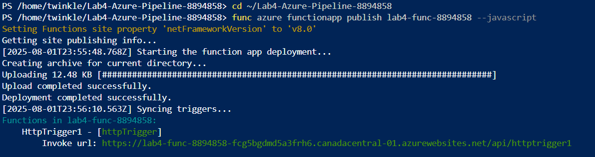
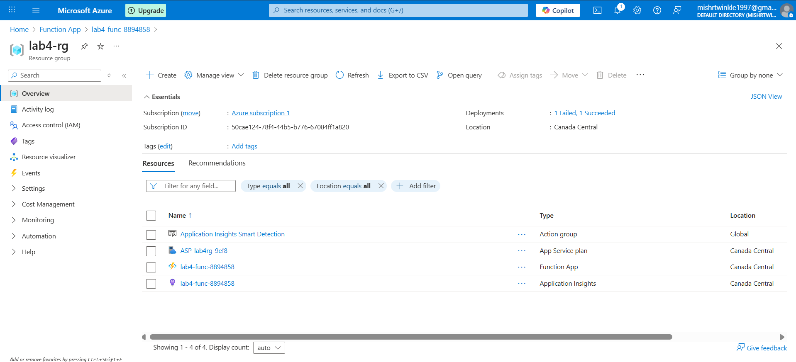
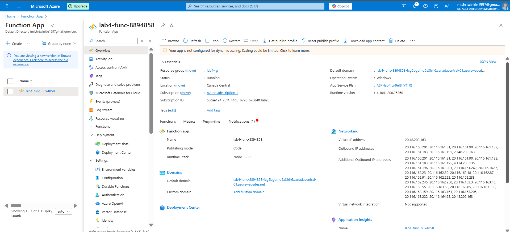
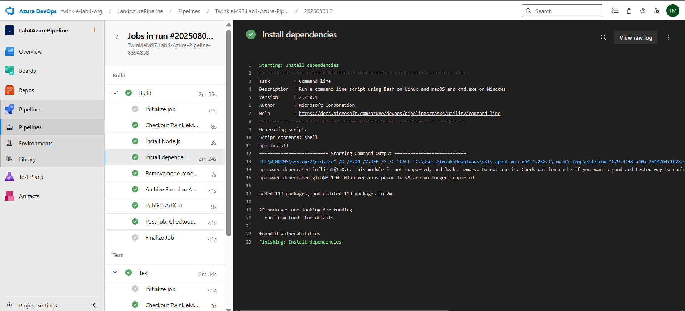
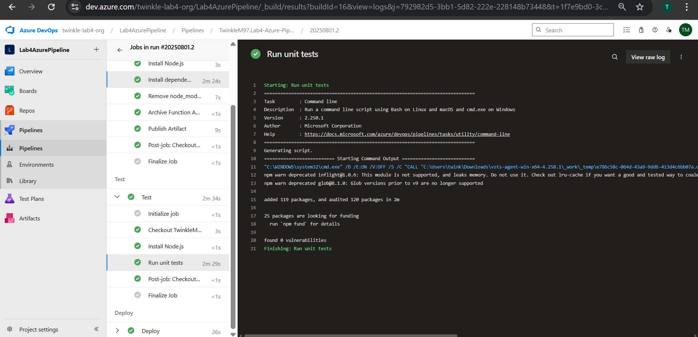
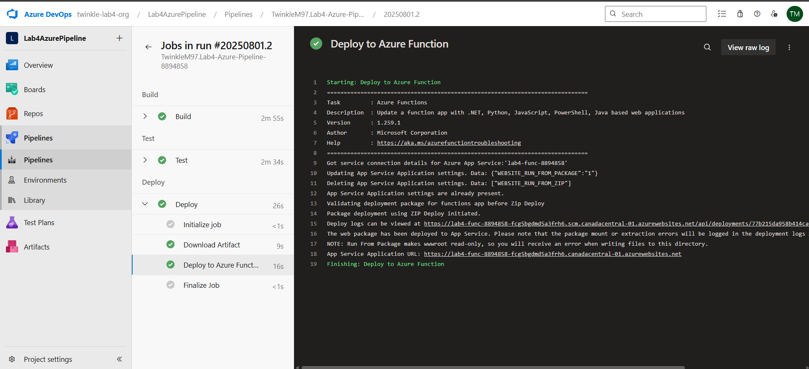
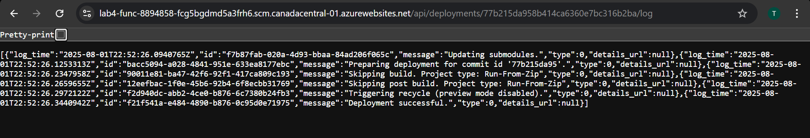
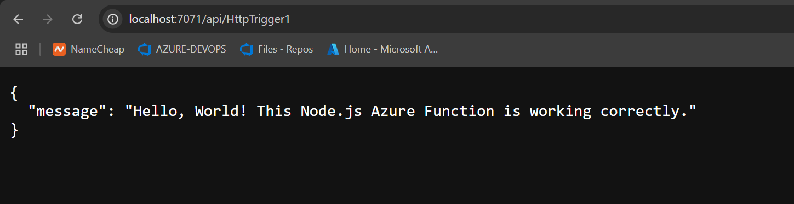
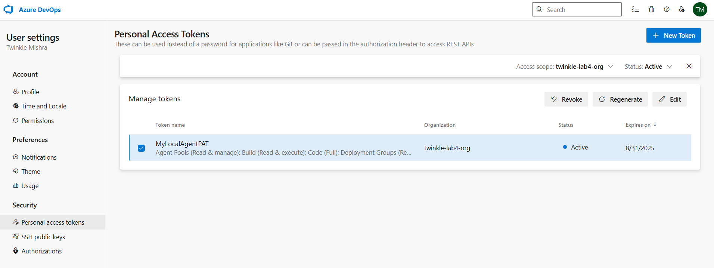
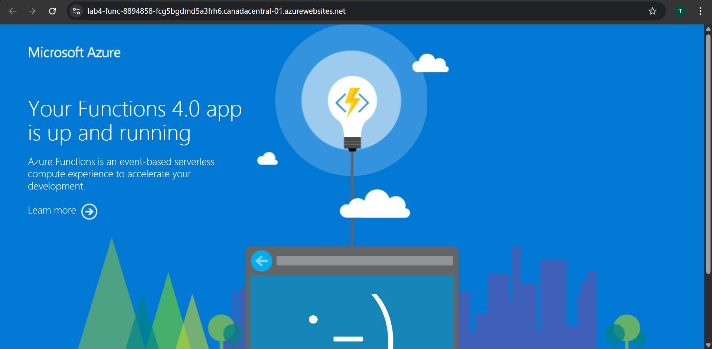

# Lab 4 – Azure CI/CD Pipeline (8894858)

This lab demonstrates how to automate the deployment of a **Node.js Azure Function** using **Azure DevOps Pipelines**, with Build, Test, and Deploy stages, triggered by Git commits.

---

## Tech Stack

- Azure DevOps (Repos + Pipelines)
- Node.js Azure Function
- Azure Function App on Consumption Plan
- GitHub source integration
- Self-hosted Agent with PAT authentication

---
## File Folder

Lab4-Azure-Pipeline-8894858/
├── HttpTrigger1/
│ ├── index.js
│ ├── function.json
│ └── test/
│ └── HttpTrigger1.test.js
├── azure-pipelines.yml
├── host.json
├── package.json
├── package-lock.json
---

## CI/CD Pipeline Steps with Screenshots

### 1. Azure CLI used to deploy Function App resources
Manually deployed Function App resources using Azure CLI commands:

> 

---

### 2. Azure Function App confirmed in the Portal
Resource group and Function App are visible in the Azure portal.

> 

---

### 3. Azure Function appeared in Azure UI
Function App successfully created with correct configuration.

> 

---

### 4. CI/CD Pipeline triggered on Git push
Git push triggered the Azure DevOps pipeline automatically.

> 

---

### 5. Build stage executed successfully
Build step completed with correct installation of dependencies.

> 

---

### 6. Tests executed using Mocha/Chai
Custom test logic ran successfully using `mocha` in the test stage.

> 

---

### 7. Deployment step completed
Pipeline deployed the Azure Function to the cloud without issues.

> 

---

### 8. Deployment logs verified
Deployment logs from Azure DevOps confirmed successful delivery.

> 

---

### 9. Function tested locally (localhost:7071)
The Azure Function is running using `func start` and hit the HTTP endpoint locally.

> 

---

### 10. Self-hosted agent configured and active
Created a token (`MyLocalAgentPAT`) to allow agent authentication with Azure DevOps & Registered a local agent successfully to offload jobs from hosted agents.

> 

---
### 11. Verified Azure Function App Live on Default Domain

The deployed Node.js Azure Function was successfully hosted and accessible via the default Azure Functions domain.
Link: https://lab4-func-8894858-fcg5bgdmd5a3frh6.canadacentral-01.azurewebsites.net/

---

